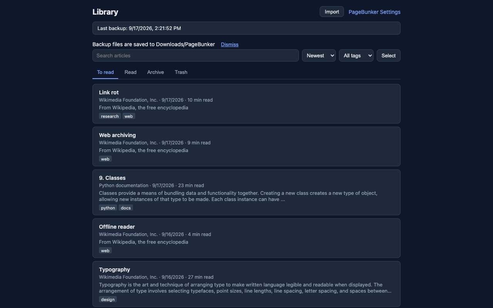

# PageBunker

**Save articles. Read offline.**

[Website](https://elitekid.github.io/pagebunker/) · [Privacy policy](PRIVACY.md) · [Report a problem](https://github.com/elitekid/pagebunker/issues)

**Install:** [Microsoft Edge Add-ons](https://microsoftedge.microsoft.com/addons/detail/pagebunker/mmlfiljlnohhhjacaoniejfelagjcgna). Chrome and Firefox listings are in review.



## Why a file on disk

PageBunker keeps your saved articles in the browser, but that storage disappears when you uninstall the extension or reset your browser profile. To survive that, every change also writes a backup file to a PageBunker folder in your Downloads folder.

1. **In-browser copies** — the 3 most recent backup snapshots live inside the extension.
2. **On-disk JSON files** — when your articles change, `Downloads/PageBunker/pagebunker-latest.json` is updated. At most once a day, if your articles changed, a dated copy is also written; the latest 7 are kept.

The JSON files in your Downloads folder remain on disk and can be used to restore after a reinstall. Copy them elsewhere if you want an extra safety net.

## Features

- **Save this article** — toolbar button (then Save in the panel), `Alt+Shift+L` (`Option+Shift+L` on Mac), or right-click menu. Title, author, publish date, and body are extracted; ads, menus, and comments are left out. If the body cannot be extracted, the link is saved instead.
- **Library** — To read, Read, Archive, and Trash. Articles in Trash are deleted automatically after 30 days. Sort, add tags, and select multiple articles at once.
- **Reader** — saved articles open without an internet connection, and still open after the original page is deleted. Adjust font size, line spacing, and width. Light and dark themes. Remembers where you stopped reading. Marks an article as read when you reach the end (can be turned off).
- **Images off by default** — no request goes to the original site until you click "Show images" in an article or turn them on in settings.
- **Search** — search titles, sites, tags, and full article text in English and Korean.
- **Import** — Pocket CSV export (unzip the downloaded file and choose the CSV), Pocket legacy HTML export, Instapaper CSV, and browser bookmarks HTML. Preview before importing. Each import can be undone as a whole. Imported items arrive as links; open the original page and save it to fill in the article body.
- **Backup and restore** — automatic backup to Downloads. Restore after reinstall with merge or replace; a replace can be undone once.
- **Export** — selected articles as a single HTML file or as one Markdown file per article.
- **Browsers** — Chrome and Edge (same zip), Firefox (separate zip).
- **Languages** — English and Korean UI.

## Where your data lives

| Location | What |
|----------|------|
| Browser | Saved articles, tags, reading positions, settings, and the 3 most recent backup copies |
| Disk | `Downloads/PageBunker/pagebunker-latest.json` (always the newest) and dated files (daily, 7 kept) |
| Anywhere else | Nothing. No account, no server, no analytics |

Backup files are plain JSON. You can open them in any text editor, copy them, or store them outside Downloads.

## Permissions, explained

| Permission | Why PageBunker needs it |
|------------|-------------------------|
| `activeTab` | Read the article only in the tab where you use PageBunker |
| `scripting` | Run the article extraction code in that tab |
| `storage` / `unlimitedStorage` | Store saved articles and settings locally |
| `downloads` | Write backup and export files to your Downloads folder. Nothing is uploaded |
| `alarms` | Schedule backups and daily trash cleanup |
| `contextMenus` | Add the right-click menu item for saving |
| `offscreen` (Chrome and Edge only) | Build large backup files |

No `host_permissions`. No access to all websites. No account. No analytics SDK.

Because of the `downloads` permission, Chrome shows "Manage your downloads" at install. Firefox shows "Download files and read and modify the browser's download history" at install.

## Import / Export

**Supported import formats**

- Pocket CSV export (unzip the downloaded file and choose the CSV)
- Pocket legacy HTML export
- Instapaper CSV
- Browser bookmarks HTML

Preview before importing. Each import can be undone as a whole. Imported items arrive as links; open the original page and save it to fill in the article body.

**Export formats**

- Single HTML file (selected articles)
- One Markdown file per article

Open the library page, use **Import** or **Export**, and review the preview before confirming.

## Verify it makes no network requests

1. Open the library or options page, then open Developer Tools (`F12` or `Cmd+Option+I`).
2. Go to the **Network** tab and enable **Preserve log**.
3. Use PageBunker normally (save, read, search, import, export). The request list should stay empty — PageBunker does not call any remote server.

A request goes to a website only when you open the original page of a saved article or load images.

## The uninstall drill

Before you rely on PageBunker as your only article archive, run this once:

1. **Import your Pocket or bookmark export** and confirm the items look right in the library.
2. **Save a few articles** and check that `Downloads/PageBunker/` receives backup files.
3. **Next week, uninstall PageBunker on purpose**, reinstall it, and restore from `pagebunker-latest.json`. If that works, you know the file backup path is solid.

## Build from source

```bash
npm run build
```

Output:

- `dist/chrome` — load unpacked in Chrome or Edge (`chrome://extensions`)
- `dist/firefox` — load temporary add-on in Firefox (`about:debugging`)
- `dist/pagebunker-chrome.zip` — Chrome and Edge store package
- `dist/pagebunker-firefox.zip` — Firefox AMO package

## Privacy

See [PRIVACY.md](PRIVACY.md) for the full policy.

PageBunker collects no user data, makes no network requests on its own, and stores everything locally in your browser and Downloads folder.

## License

MIT — see [LICENSE](LICENSE).

## Contributing

Bug reports, import failures, and backup or restore questions are welcome via GitHub Issues. Choose a template when you open a new issue:

- [Bug report](.github/ISSUE_TEMPLATE/bug_report.md)
- [Import failed](.github/ISSUE_TEMPLATE/import_failed.md)
- [Backup and restore](.github/ISSUE_TEMPLATE/backup_restore.md)

---

**TabBunker** — close your tabs and keep a backup in your Downloads folder. [Website](https://elitekid.github.io/tabbunker/)
